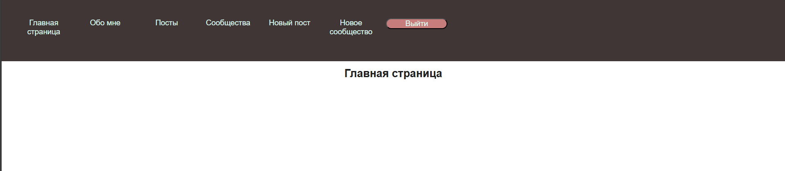
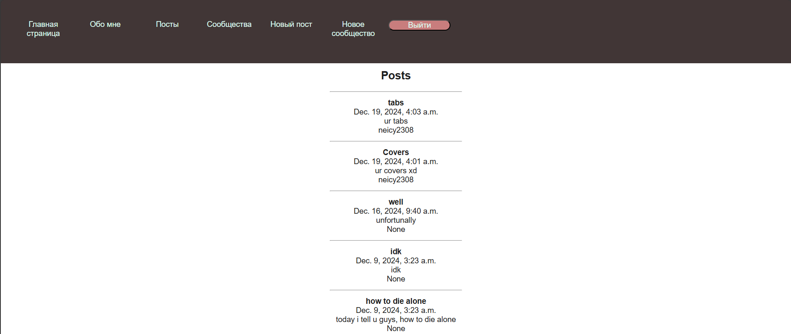
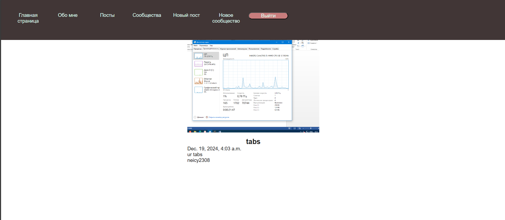
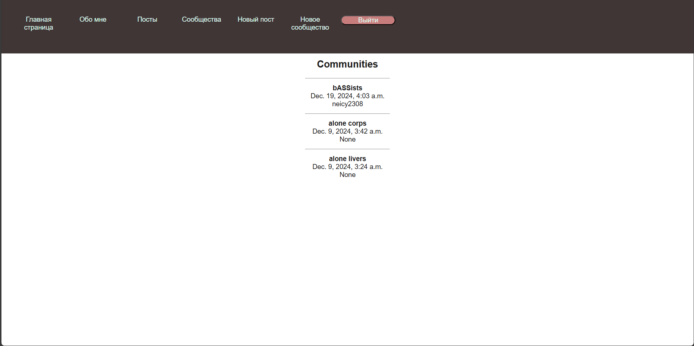
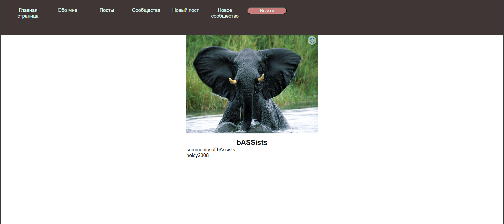
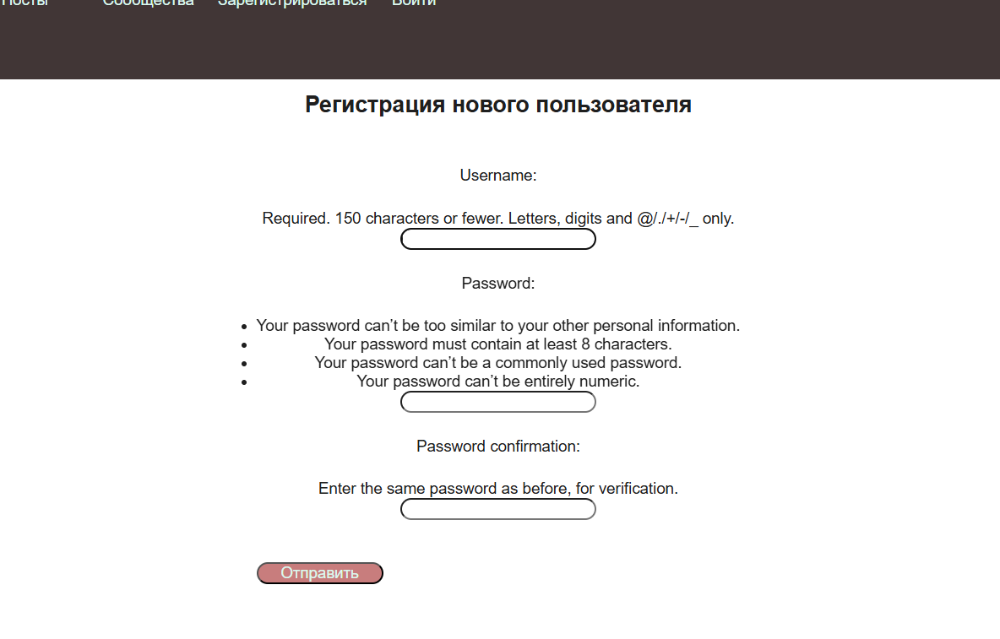
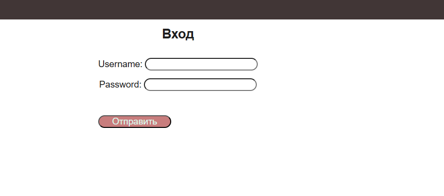

<h1 align="center">Здравствуйте. Это пример веб-приложения созданного с помощью django.</h1>
<ul>
    <h2 id="oglav">Оглавление</h2>
    <li><a href="#localhost"> Запуск сервера</a></li>
    <li><a href="#main"> Главная страница и header</a></li>
    <li><a href="#about-me"> Страница "Обо мне"</a></li>
    <li><a href="#posts"> Страница с постами</a></li>
    <li><a href="#post"> Страница поста</a></li>
    <li><a href="#communities"> Страница с сообществами</a></li>
    <li><a href="#community"> Страница сообщества</a></li>
    <li><a href="#post-new"> Страница создания поста</a></li>
    <li><a href="#community-new"> Страница создания сообщества</a></li>
    <li><a href="#register"> Страница регистрации</a></li>
    <li><a href="#login"> Страница входа</a></li>

<h1 align="center" id="localhost">Запуск сервреа</h1>

## 1.Сперва необходимо переместиться в директорию где лежит файл manage.py.

```
cd lab1
```
## 2.Запустим сервер.

```
py manage.py runserver
```
Или
```
python manage.py runserver
```

### *В зависимости от системы нужно написать или ``` py ``` или ```python```

### 3. После запуска сервера перейдём на - [сайт](http://127.0.0.1:8000/).
<h2 align="center" id="main"> Главная</h2>
</br>



 На главной странице пока пусто. В header расположенны ссылки на страницы: Обо мне, Посты, сообщества, регистрации и входа *если пользователь не авторизован* и кнопки создания сообщества и поста, если *пользователь авторизован*
<a href="#oglav">В оглавление</a>
<h2 align="Center" id="about-me">Обо мне</h2>
</br>

 Информации обо мене нет. Я аноним
<a href="#oglav">В оглавление</a>
 <h2 align="Center" id="posts">Посты</h2>
</br>

 На этой странице отображаются все посты с их названием и описанием
<a href="#oglav">В оглавление</a>
<h2 align="Center" id="post">Страница поста</h2>
</br>

Страница поста. Картинка, кто загрузил, дата загрузки, описание и название
<a href="#oglav">В оглавление</a>
<h2 align="Center" id="communities">Сообщества</h2>
</br>

 На этой странице отображаются все сообщества с их названием и описанием
<a href="#oglav">В оглавление</a>
<h2 align="Center" id="community">Страница сообщества</h2>
</br>

Страница сообщества. Картинка, кто загрузил, дата загрузки, описание и название
<a href="#oglav">В оглавление</a>
<h2 align="Center" id="post-new">Загрузка поста</h2>
</br>

Страница добавления нового поста, где ```title``` - название, ```body``` - описание, ```slug``` - краткое название поста, а ```bannner``` - изображение для поста
<a href="#oglav">В оглавление</a>
<h2 align="Center" id="community-new">Загрузка сообщества</h2>
</br>

Страница добавления нового сообщества, где ```name``` - название, ```description``` - описание, ```slug``` - краткое название поста, а ```avatar``` - изображение для сообщества
<a href="#oglav">В оглавление</a>
<h2 align="Center" id="register">Страница регистрации</h2>
</br>

 Форма регистрации с полями для ввода логина и пароля с его подтверждением
<a href="#oglav">В оглавление</a>
<h2 align="Center" id="login">Страница входа в аккаунт</h2>
</br>

 Форма входа с полями для ввода логина и пароля 


